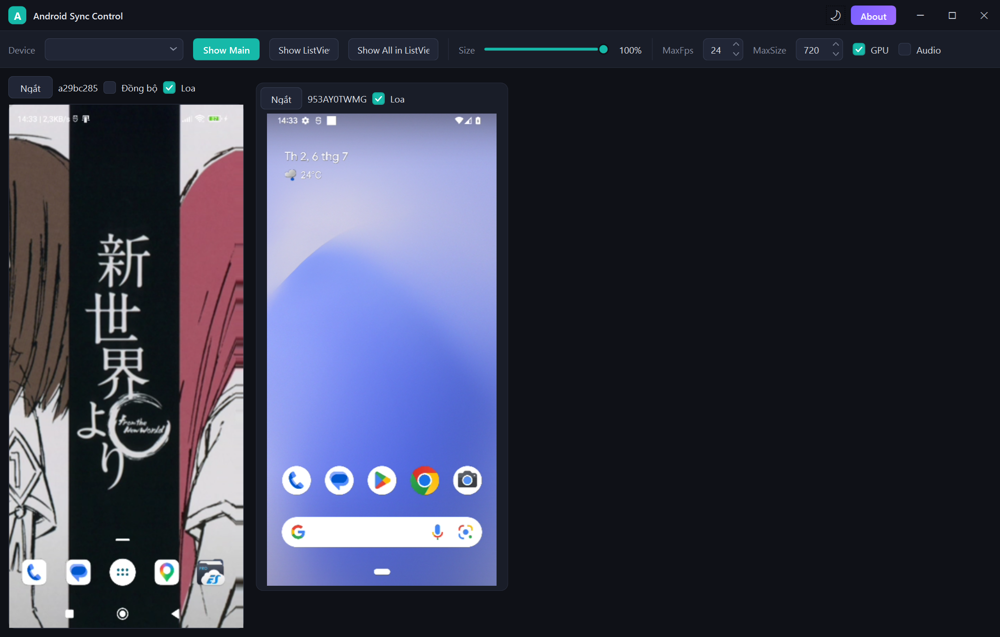
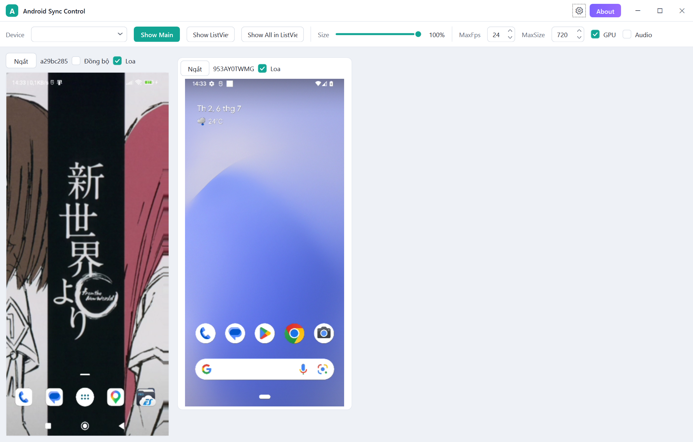

# Android Sync Control

> Phản chiếu và điều khiển **đồng bộ nhiều thiết bị Android cùng lúc** — ngay trên PC Windows.

[English](README.md) · **Tiếng Việt**


Android Sync Control là ứng dụng Windows gọn nhẹ giúp phản chiếu và điều khiển nhiều thiết bị
Android cùng lúc. Bật **Đồng bộ** trên máy chính, mọi thao tác chạm và phím sẽ được gửi tới tất
cả thiết bị còn lại cùng một lúc — thao tác một lần, chạy trên mọi máy.
Xây dựng dựa trên [scrcpy](https://github.com/Genymobile/scrcpy).



## Tính năng

- **Điều khiển đồng bộ** — Bật *Đồng bộ* trên máy chính: mọi thao tác chạm và phím được gửi tới
  tất cả thiết bị đang kết nối cùng lúc.
- **Đa thiết bị** — Hiển thị và điều khiển nhiều điện thoại song song trong một lưới. Thiết bị
  được tự động phát hiện qua ADB, thêm/bớt tức thì.
- **Âm thanh ra loa PC** — Nghe âm thanh phát từ thiết bị trực tiếp qua loa máy tính (XAudio2).
  Bật/tắt tiếng riêng cho từng máy mà không ngắt kết nối.
- **Tăng tốc GPU** — Giải mã video bằng phần cứng qua Direct3D 11 (D3D11VA) cho hình ảnh mượt,
  nhẹ CPU. Tùy chỉnh FPS và độ phân giải tối đa để cân bằng chất lượng và tải.
- **Tự động kết nối lại** — Thiết bị khởi động lại hay rớt kết nối? Ứng dụng tự chờ máy sẵn sàng
  rồi kết nối lại — không cần thao tác thủ công.
- **Giao diện Sáng / Tối** — Ba chế độ: theo hệ thống, Sáng hoặc Tối. Giữ màn hình thiết bị luôn
  sáng và hiển thị điểm chạm.

## Hình ảnh

| Giao diện Sáng | Giao diện Tối |
|----------------|---------------|
|  |  |

## Yêu cầu

- Windows 10/11 (**x64**)
- Thiết bị Android đã bật **Gỡ lỗi USB** (trong Tùy chọn nhà phát triển)
- Kết nối USB (hoặc ADB qua Wi‑Fi). ADB đã được đóng gói sẵn trong ứng dụng.

## Tải về

Tải bản mới nhất tại trang [**Releases**](https://github.com/tqk2811/AndroidSyncControl/releases)
(`AndroidSyncControl-<phiên bản>-net8.0-windows.zip`). Không cần cài đặt — giải nén và chạy
`AndroidSyncControl.exe`.

## Cách dùng

1. Trên điện thoại, bật **Tùy chọn nhà phát triển → Gỡ lỗi USB**, cắm cáp USB và chấp nhận
   yêu cầu gỡ lỗi.
2. Chạy `AndroidSyncControl.exe`. Thiết bị đang kết nối sẽ xuất hiện ở ô **Device**.
3. Chọn thiết bị và cách hiển thị:
   - **Show Main** — đưa thiết bị đã chọn vào khung chính lớn (điều khiển đầy đủ).
   - **Show ListView** — thêm thiết bị đã chọn vào lưới bên phải.
   - **Show All in ListView** — thêm tất cả thiết bị đang nhận vào lưới cùng lúc.
4. Tích **Đồng bộ** trên máy chính để điều khiển toàn bộ thiết bị trong lưới cùng lúc.
5. Tinh chỉnh thanh công cụ theo nhu cầu.

### Bảng thanh công cụ

| Điều khiển | Chức năng |
|------------|-----------|
| **Size** | Tỉ lệ hiển thị màn hình xem trước (1–150%). |
| **MaxFps** | Giới hạn FPS video (1–120). Áp dụng ở lần kết nối kế tiếp. |
| **MaxSize** | Giới hạn cạnh dài nhất của video (px, bội số 8). Dưới 360 = kích thước gốc. Áp dụng khi kết nối lại. |
| **GPU** | Bật: giải mã phần cứng D3D11VA. Tắt: giải mã bằng CPU. Áp dụng khi kết nối lại. |
| **Audio** | Bật: nhận và giải mã luồng âm thanh từ thiết bị. Áp dụng khi kết nối lại. |
| **Đồng bộ** | Gửi thao tác của máy chính tới tất cả thiết bị còn lại (chỉ ở khung chính). |
| **Loa** | Phát âm thanh của thiết bị đó ra loa PC (theo từng máy). |
| **Ngắt** | Ngắt kết nối thiết bị đó. |

## Build từ mã nguồn

Yêu cầu: **.NET 8 SDK**, Windows, Visual Studio 2022 (tùy chọn).

```bash
git clone https://github.com/tqk2811/AndroidSyncControl.git
cd AndroidSyncControl
dotnet build AndroidSyncControl.sln -c Release
```

Dự án nhắm mục tiêu `net8.0-windows`, **chỉ x64**.

## Công nghệ

.NET 8 · WPF · [scrcpy](https://github.com/Genymobile/scrcpy) · ADB · Direct3D 11 · XAudio2 · FFmpeg

## Ghi công & Giấy phép

Dự án này được xây dựng dựa trên các dự án mã nguồn mở tuyệt vời:

- **[scrcpy](https://github.com/Genymobile/scrcpy)** của Genymobile — giấy phép
  **Apache License 2.0**. Android Sync Control dùng scrcpy để phản chiếu và điều khiển thiết bị.
- **[FFmpeg](https://ffmpeg.org)** — dùng để giải mã video/âm thanh, theo giấy phép
  **GNU General Public License v3 (GPLv3)**.

Vì có đóng gói và liên kết với bản FFmpeg GPLv3, việc phân phối Android Sync Control tuân theo
các điều khoản của **GPLv3**.

Thực hiện bởi [tqk2811](https://github.com/tqk2811).
